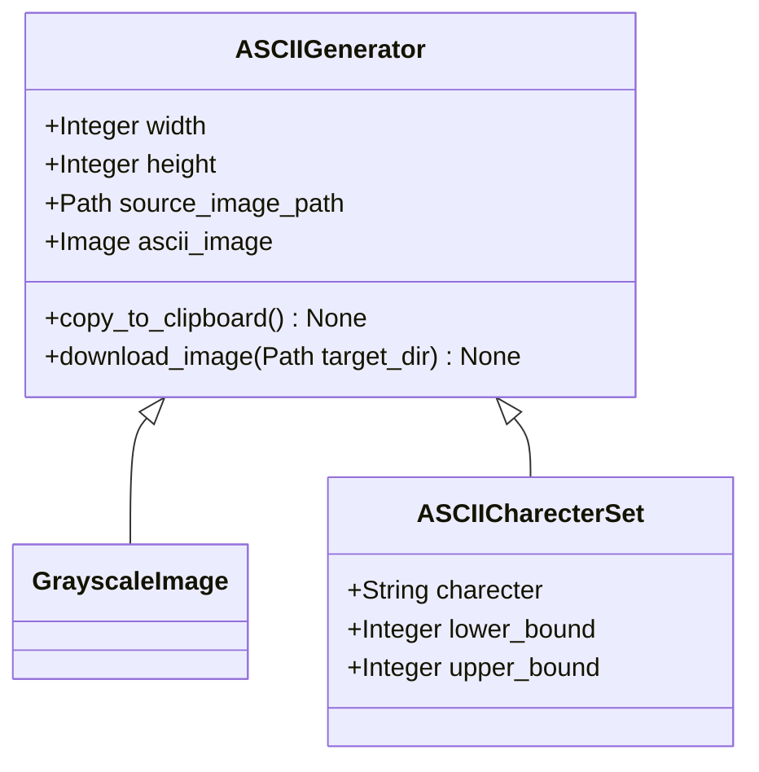

# ascii-image-generator

Generate ASCII art from normal images

## Package Structure

```mermaid
classDiagram

class ASCIIGenerator {
    +Integer width
    +Integer height
    +Path source_image_path
    +Image ascii_image

    +copy_to_clipboard() None
    +download_image(Path target_dir) None
}

class ASCIICharecterSet {
    +String charecter
    +Integer lower_bound
    +Integer upper_bound
}

ASCIIGenerator <|-- GrayscaleImage
ASCIIGenerator <|-- ASCIICharecterSet

```
